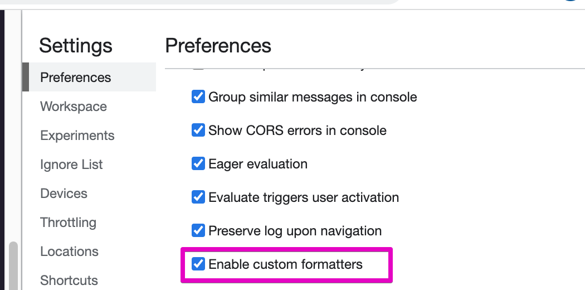
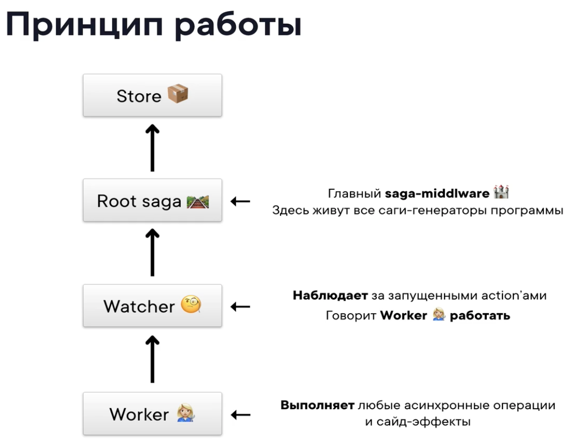
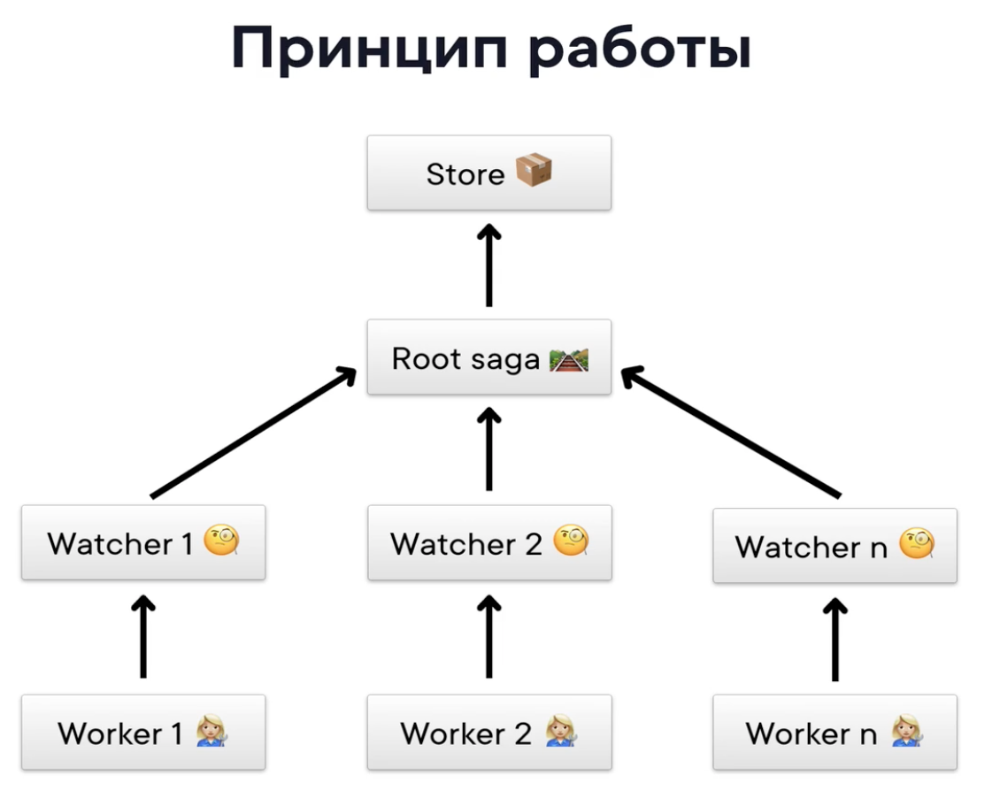
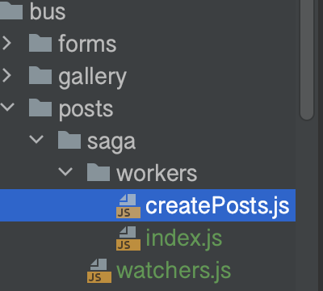

## 10. Практика. 1 часть

Структура приложения будет состоять из доменов.
Домен это папка, содержащая информацию о отдельной части приложения

Наш первый домен: _Gallery_

## 13. Практика. 4 часть
Настройка синхронизации initialState с localStorage
```javascript
const preloadedState = JSON.parse(localStorage.getItem('gallery'))

export const store = preloadedState
    ? createStore(rootReducer, preloadedState, enhancedStore)
    : createStore(rootReducer, enhancedStore);

store.subscribe(() => {
    const state = store.getState();
    localStorage.setItem('gallery', JSON.stringify(state))
})
```

# Теория продвинутые концепции

- Redux - синхронный по умолчанию
- Основан на чистых функциях и иммутабельных данных
- Не поддерживает асинхронные операции и сайд эффекты

Для асинхронных операций и сайд эффектов есть миддлвары


## 12. Практика. Как работает Immutable js
Нужно настроить отображение в консоли браузера
https://chrome.google.com/webstore/detail/immutablejs-object-format/hgldghadipiblonfkkicmgcbbijnpeog

Любая операция на сущнстью возвращает новую сущность, а старая не меняется





## 14. Практика. Знакомство с middleware

__DEV__  предоставляется webpack

---

Благодаря thunk мы можем из экшен криэторов возвращать функции, а не объекты


## 47. Redux-saga principles





## 40. Saga development


## 51. Practice. Root saga

_store.js_
```javascript
import {enhancedStore, sagaMiddleware} from "./middleware/core";
import {rootSaga} from "./middleware/rootSaga";

export const store = createStore(rootReducer, enhancedStore);

sagaMiddleware.run(rootSaga);
```

_rootSaga.js_
```javascript
export function* rootSaga () {
    yield console.log('init saga')
}
```

_core.js_
```javascript
const sagaMiddleware = createSagaMiddleware()

const middleware = [
    sagaMiddleware,
    ...
];

const enhancedStore = composeEnhancers(applyMiddleware(...middleware));

export {enhancedStore, sagaMiddleware};
```

## 52. Posts sagas


